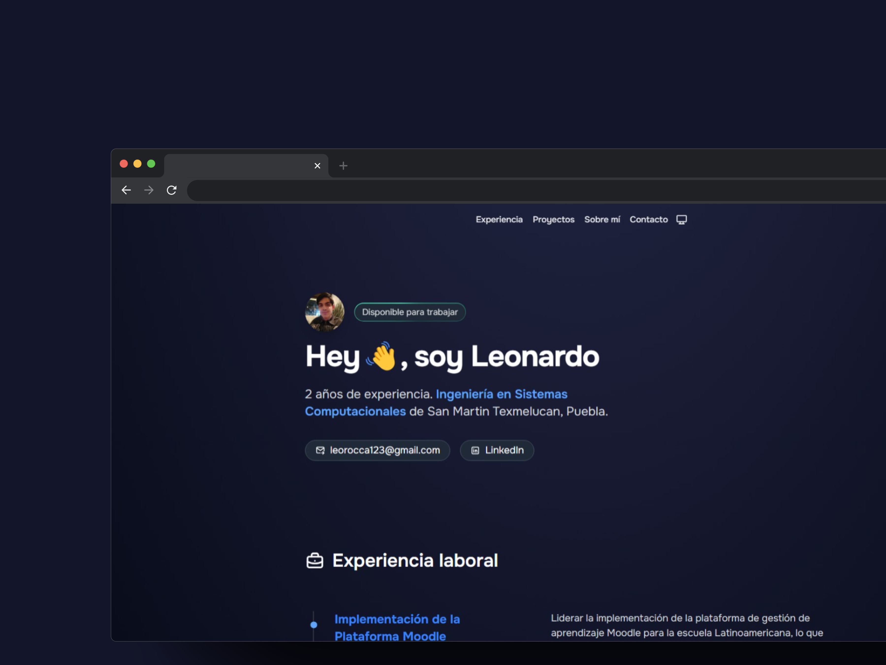

<<<<<<< HEAD
# 👨🏻‍💻 Porfolio Leonardo Rocca Herrera

## Descripción
https://porfolio-leonardo.netlify.app/

## Tecnologías utilizadas

## Comandos / Indicaciones técnicas

| Comando                  | Acción realizada                                   |
| :---------------------   | :------------------------------------------------- |
| `npm create astro@latest`| Crea un proyecto nuevo de Astro                    |
| `npm install`            | Instala todas las dependencias                     |
| `npm run dev`            | Inicia un server de desarrollo en `localhost:4321` |
| `npm run build`          | hace el build de producción en `./dist/`           |
| `npm run preview`        | Para previsualizar el build antes de deployar      |
| `npm run astro ...`      | Comandos de CLI como `astro add`, `astro check`    |
| `npm run astro --help`   | Ayuda para utilizar el CLI de Astro                |

## 🫂 Reconocimientos

Este proyecto está basado en [porfolio.dev](https://github.com/midudev/porfolio.dev) por [Miguel Ángel Durán]. Este trabajo está licenciado bajo la Licencia Attribution-NonCommercial 4.0 International.

=======
# porfolio-leonardo
Portafolio para mostrar mi experiencia 
>>>>>>> ea642ff4eccd661bbb7b9cc613fea258e88858a2
